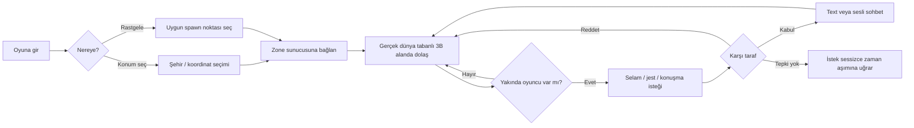
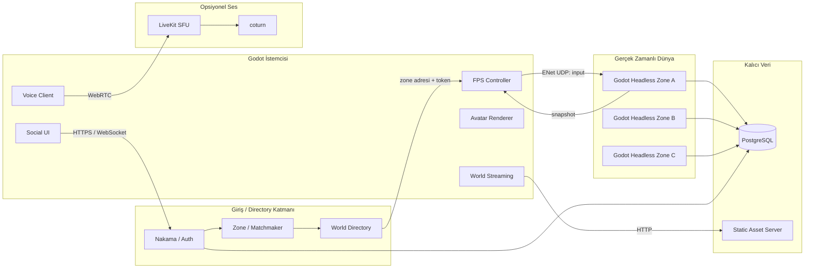
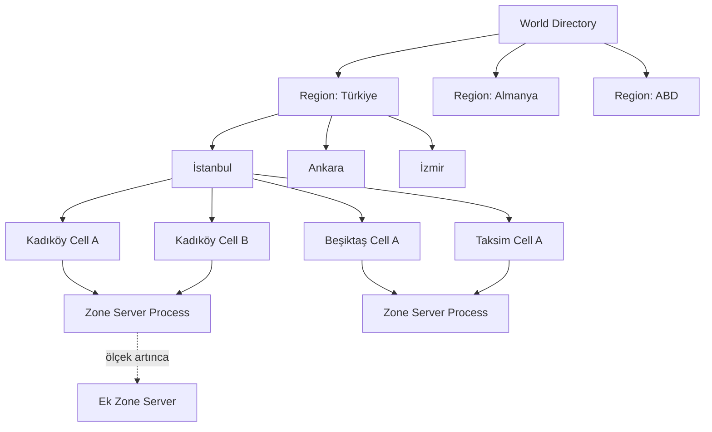
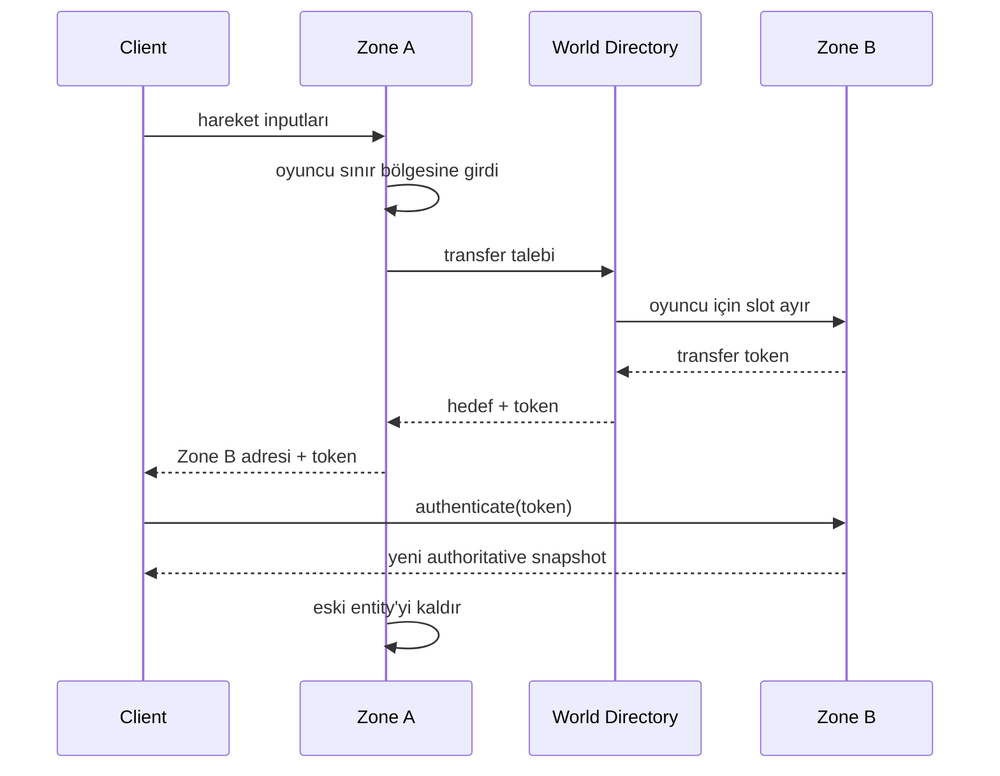
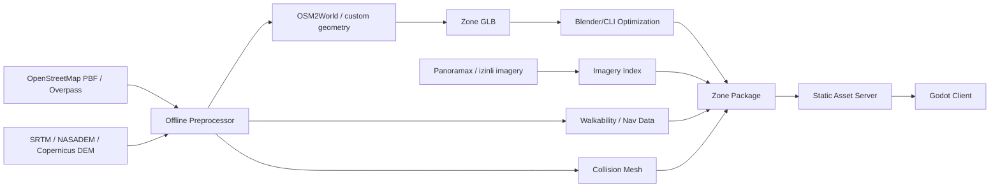
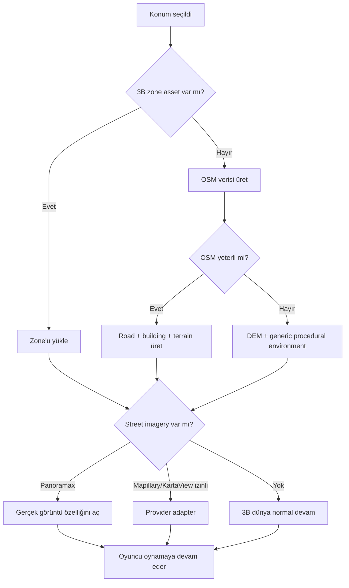
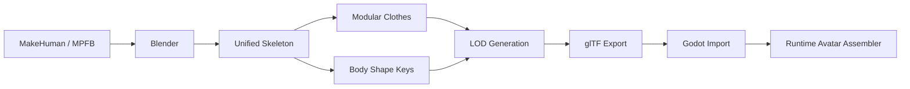
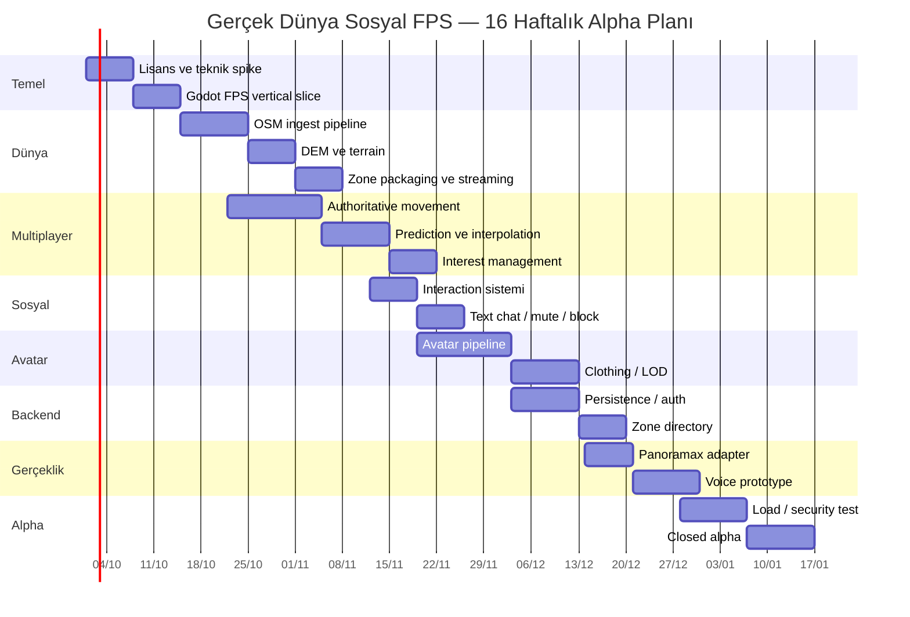
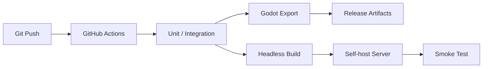

# Gerçek Dünya Tabanlı Canlı Sosyal FPS Oyunu — Ürün ve Teknik Uygulama Planı

## Yönetici özeti

**Tarih:** 24 Eylül 2026  
**Hedef:** Kullanıcıların gerçek dünyadaki bir konumu seçerek veya rastgele bir yere “ışınlanarak”, FPS benzeri bir bakış açısından dolaşabildiği; boy, vücut yapısı, görünüm ve kıyafetlerini belirlediği; diğer oyunculara yaklaşarak konuşma/etkileşim isteği gönderebildiği; karşı tarafın kabul edebildiği, reddedebildiği veya tamamen görmezden gelebildiği canlı ve zamanla büyüyen sosyal bir dünya oluşturmak.

En önemli teknik karar şudur:

> **Oyunun temel dünyasını Google Street View görüntülerinden kurmamak gerekir.** Bunun yerine oynanabilir 3B dünya OpenStreetMap + yükseklik verisi + prosedürel 3B geometri ile oluşturulmalı; sokak fotoğrafları yalnızca opsiyonel bir “gerçeklik katmanı” olarak kullanılmalıdır.

Bunun iki nedeni vardır. Birincisi, 360° sokak fotoğrafı bir FPS haritası değildir: kendi başına zemin yüksekliği, bina çarpışması, kaldırım sınırı, merdiven, kapı, yürünebilir alan veya fizik geometrisi sağlamaz. İkincisi ve daha önemlisi, güncel Google Maps Platform şartları Google Maps içeriğinin scraping, toplu indirme, önceden getirme, saklama/yeniden barındırma gibi kullanımlarını ciddi biçimde kısıtlıyor; şartlar ayrıca Google Maps içeriğinden belirli türetilmiş içeriklerin oluşturulmasına ilişkin yasaklar içeriyor. Street View Static API de API anahtarı ve ücretlendirme modeline bağlı. Dolayısıyla “tamamen ücretsiz, kendi sunucumda büyüteceğim bir dünya” için Google Street View çekirdek veri kaynağı olarak uygun değil. citeturn0search1turn0search0turn0search8

Önerdiğim temel mimari:

```text
Godot 4
    +
OpenStreetMap
    +
SRTM/NASADEM veya Copernicus DEM
    +
OSM2World / özel prosedürel dünya üreticisi
    +
Godot headless authoritative zone server
    +
PostgreSQL
    +
Nakama (oyuncu hesabı/matchmaking, büyüme aşamasında)
    +
Panoramax (opsiyonel sokak görüntüsü)
    +
LiveKit veya Mumble (ses, ikinci aşamada)
    +
Blender + MakeHuman/MPFB (avatar üretimi)
```

Godot bu proje için Unity'den daha mantıklı başlangıç noktasıdır. Godot ücretsiz ve açık kaynaklıdır, motor lisansı MIT'dir, dedicated/headless server çalıştırılabilir ve yüksek seviyeli multiplayer API'sinde ENet, WebRTC ve WebSocket seçenekleri bulunur. Unity Personal halen ücretsiz bir katman sunsa da 2026 itibarıyla gelir/funding eşiği gibi ticari şartlara bağlıdır; dolayısıyla “motor tarafında hiçbir zaman lisans ücreti çıkmasın” hedefi için Godot daha temiz seçimdir. citeturn6search0turn8view1turn8view0turn7search1turn7search7turn7search17

**Önerilen ilk ürün hedefi global dünya değildir.** İlk sürüm:

| Parametre | İlk hedef |
|---|---|
| Platform | Windows + Linux masaüstü |
| Motor | Godot 4.x |
| Dünya | Tek pilot şehirde yaklaşık 1–4 km² |
| Oyuncu | Zone başına 4–20 |
| Toplam alpha | Yaklaşık 10–50 eşzamanlı kullanıcı |
| Görünüm | FPS |
| Dünya | OSM + DEM tabanlı 3B |
| Sokak görüntüsü | Panoramax varsa opsiyonel |
| Avatar | Boy/vücut sliderları + saç + kıyafet |
| Sosyal sistem | Yaklaş, selamla, konuşma isteği, kabul/ret/ignore |
| İlk chat | Proximity text chat |
| Ses | Closed-alpha aşamasında eklenir |
| NPC | İlk MVP'de şart değil |
| Backend | Önce tek Linux sunucu |
| Networking | Dedicated authoritative |
| Harita geçişi | Zone/cell sistemi |
| Veri tabanı | Başlangıç SQLite veya doğrudan PostgreSQL |
| Ücretli API | Yok |

Bu yaklaşımın kritik avantajı, **sokak fotoğrafı bulunmadığında oyunun bozulmamasıdır**. Panoramax/Mapillary/KartaView kapsaması olmayan yerde de OSM yolu, bina hacimleri ve DEM arazi üzerinden dolaşılabilir.

“Tamamen ücretsiz” kavramını da ikiye ayırmak gerekir. **Yazılım, veri kaynağı ve üçüncü taraf API lisans maliyetini sıfıra çok yaklaştırmak mümkündür.** Ancak yüzlerce veya binlerce oyuncuya gerçek zamanlı sunucu, ses ve dünya asset'i sunarken CPU, disk, elektrik ve internet trafiğinin fiziksel maliyeti ortadan kalkmaz. Kendi bilgisayarında/self-host çalıştırırsan servis faturası ödemezsin ama elektrik ve interneti sen karşılamış olursun. Bu yüzden hedefi **“paid SaaS/API kullanmadan self-host edilebilir”** olarak tanımlamak doğru olur.

Tahminim, deneyimli iki geliştirici ve yarı zamanlı 3B/asset desteğiyle **oynanabilir MVP'nin yaklaşık 8–10 haftada, kapalı alpha kalitesinin 14–16 haftada** elde edilebileceğidir. Tek deneyimli geliştirici için gerçekçi süre yaklaşık 4–6 ay; oyun/network/geospatial konularında yeni bir geliştirici için daha uzun düşünülmelidir. Bunlar proje tahminleridir, hizmet sağlayıcı vaatleri değildir.

## Ürün kapsamı, oyun döngüsü ve MVP

**Temel ürün fikrini “Google Street View içinde yürüyen multiplayer oyun” olarak değil, “gerçek coğrafyadan türetilmiş yaşayan sosyal dünya” olarak tanımlamak daha doğru.**

Oyuncunun ana döngüsü şöyle olmalı:



Buradaki **“tepki vermemek” ayrı ve geçerli bir oyun durumu** olmalıdır. Oyunun sosyal mekaniklerini NPC oyunlarındaki gibi “E'ye basınca konuşma başlar” biçiminde tasarlamak yanlış olur. Gerçek kişiye yaklaşıldığında yalnızca iletişim teklifi yapılmalıdır.

Önerilen UX:

| Mesafe/durum | Kullanıcının yapabileceği |
|---|---|
| 20–50 m | Oyuncuyu görür, isim tercihe göre gizli olabilir |
| 5–10 m | El sallama, baş selamı gibi jest |
| 2–4 m | “Konuşmak ister misin?” isteği |
| Karşı taraf kabul etmezse | Hiçbir kanal açılmaz |
| Kabul ederse | Önce text; ses açıksa proximity voice |
| Ignore | İstekte bulunan kişiye “reddetti” bilgisi vermek zorunda değilsin |
| Block | İki oyuncu birbirini görmez/duymaz veya minimum etkileşim |
| Report | Sunucu tarafında olay ID'si oluşturulur |

Böylece rahatsız edici bir tasarım oluşmaz.

**Rastgele konum sistemi** de saf `random(latitude, longitude)` olmamalıdır. Aksi halde oyuncuyu denize, otoyol ortasına, özel araziye, bina içine veya boş araziye atabilirsin. Spawn sistemi önce OSM'den yürünebilir yol/kaldırım/alan adayları çıkarmalı, daha sonra seçim yapmalıdır. OSM verileri açık veri olarak kullanılabilir; ancak OpenStreetMap Foundation özellikle ücretsiz OSM tile sunucularının bir genel amaçlı CDN olmadığını, toplu/offline indirme için kullanılmaması gerektiğini açıkça belirtiyor. Üretim sisteminde ham OSM verisini indirip kendi dünya pipeline'ından geçirmek veya kendi tile/asset sunucunu çalıştırmak gerekir. citeturn1search1turn1search5turn1search2turn1search10

Önerilen random spawn skoru:

```text
spawn_score =
    0.30 * pedestrian_access
  + 0.20 * street_imagery_coverage
  + 0.20 * active_player_proximity
  + 0.15 * POI_density
  + 0.10 * terrain_safety
  + 0.05 * novelty
```

Burada `active_player_proximity` özellikle ilk zamanlarda önemlidir. Oyuncu sayısı azken İstanbul'un tamamına 10 kişiyi dağıtırsan herkes yalnız kalır. Bu nedenle sistem:

```text
"Tamamen rastgele dünya"
ve
"Birileriyle karşılaşabileceğim rastgele yer"
```

şeklinde iki farklı mod sunabilir.

İkinci mod aktif kullanıcıların bulunduğu zone'lara ağırlık vermelidir fakat oyuncuların kesin konumlarını menüde ifşa etmemelidir.

**Avatar tasarımında** görünüm ile gameplay fiziğini birbirinden ayırmanı öneririm. Kullanıcı boyunu, kilosunu/vücut yapısını, sunumunu, saçını ve kıyafetini özgürce değiştirebilir; ancak 80 cm avatar yapıp saklanmak veya 250 cm avatarla duvar arkasını görmek gibi exploit'leri önlemek için sunucu fizik kapsülünü sınırlar.

Örnek:

```text
Görsel boy:      150–205 cm
Gameplay kamera: 155–195 cm eşdeğeriyle clamp
Hitbox yarıçapı: dar aralık
Ağırlık sliderı: esas olarak blend shape / görünüm
```

Böylece avatar çeşitliliği korunur ama fizik avantajı satın alınamaz/yaratılamaz.

İlk MVP'nin **bilerek içermemesi gerekenler**:

| MVP dışı | Neden |
|---|---|
| Tüm dünya | Asset/data/network sorunu katlanır |
| Seamless ülke geçişi | Zone sistemi oturmadan gereksiz |
| Araç kullanımı | Fizik ve network maliyetini büyütür |
| Bina içleri | OSM verisi yetersiz ve asset maliyeti yüksek |
| Gerçek zamanlı bez fiziği | Avatar maliyetini büyütür |
| Fotogerçekçi 3B reconstruction | Lisans + GPU + veri sorunu |
| Her NPC'de LLM | CPU/GPU maliyetini patlatır |
| Yüz yükleme/deepfake avatar | Moderasyon ve kişilik hakkı riski |
| Zorunlu voice chat | Güvenlik/moderasyon yükünü erken getirir |
| Mobil | İlk optimizasyon kapsamını gereksiz büyütür |

**MVP'nin başarı kriteri** şudur:

> İki farklı bilgisayardaki iki oyuncu aynı gerçek coğrafi zone'a bağlanabilmeli, aynı OSM tabanlı caddeyi görmeli, server-authoritative biçimde dolaşabilmeli, birbirini özelleştirilmiş avatarla görmeli ve biri diğerine etkileşim isteği gönderdiğinde diğer oyuncu kabul, ret veya hiçbir tepki vermeme seçeneğine sahip olmalıdır.

Bu çalışmadan sonraki her şey genişletmedir.

## Teknik mimari, networking ve dünya sharding modeli

Tavsiye edilen ana mimari aşağıdaki gibi olmalıdır.



Godot'un resmi multiplayer dokümantasyonu ENet, WebRTC ve WebSocket tabanlı `MultiplayerPeer` uygulamalarını destekliyor. ENet/UDP gerçek zamanlı hareket için uygun temel katmandır; Godot aynı zamanda dedicated-server export akışı sağlar. citeturn8view0turn7search1

**P2P yerine authoritative dedicated server kullan.**

| Model | Avantaj | Dezavantaj | Bu proje |
|---|---|---|---|
| Saf P2P | Sunucu compute'u az | NAT, host güveni, hile, IP açığa çıkması, migration | Hayır |
| Listen server | Prototip çok hızlı | Host avantajı, host çıkınca sorun | Sadece ilk test |
| Dedicated authoritative | Güvenli state, kalıcı dünya, anti-cheat | Server gerekir | **Önerilen** |
| WebSocket authoritative | Basit backend | FPS hareketi için ekstra latency/overhead | Web sürümü için |
| ENet/UDP authoritative | Düşük gecikme | UDP port/network yönetimi gerekir | **Ana gameplay** |
| WebRTC | NAT traversal avantajı | Karmaşıklık | Ses/özel istemciler |

Sunucu hiçbir zaman:

```text
client: "Ben artık x=153.3 y=20 z=88 noktasındayım"
```

mesajına güvenmemelidir.

İstemci şunu göndermelidir:

```text
seq=19420
forward=1
strafe=-0.25
jump=false
yaw=127.5
pitch=-8.1
```

Sunucu hareketi simüle eder ve gerçek pozisyonu belirler.

Önerilen başlangıç parametreleri bir optimizasyon hedefi olarak:

```text
Server physics:      30 Hz
Client input:        20–30 Hz
Network snapshot:    10–20 Hz
Rendering:           60+ FPS
Position updates:    unreliable
Chat:                reliable
Interaction request: reliable
Inventory/avatar:    reliable
```

Bu değerler sabit gereklilik değil; profiling sonrası ayarlanmalıdır.

İstemci tarafında:

```text
client prediction
        +
server reconciliation
        +
remote entity interpolation
```

kullanılmalıdır.

Basit Godot iskeleti:

```gdscript
extends Node

const GAME_PORT := 7000
const MAX_PEERS := 64

var peer := ENetMultiplayerPeer.new()
var players: Dictionary = {}

func start_server() -> Error:
    var err := peer.create_server(GAME_PORT, MAX_PEERS)
    if err != OK:
        push_error("ENet server başlatılamadı: %s" % err)
        return err

    multiplayer.multiplayer_peer = peer
    return OK


@rpc("any_peer", "call_remote", "unreliable", 0)
func submit_input(
    sequence: int,
    movement: Vector2,
    yaw: float,
    pitch: float
) -> void:
    # Yalnızca server bu RPC'yi işlemeli.
    if not multiplayer.is_server():
        return

    var sender := multiplayer.get_remote_sender_id()

    if not players.has(sender):
        return

    # Production:
    # - sequence validation
    # - speed/rate limit
    # - movement clamp
    # - server physics
    players[sender].queue_input(
        sequence,
        movement,
        yaw,
        pitch
    )


@rpc("any_peer", "call_remote", "reliable", 1)
func request_social_interaction(target_peer: int, action: String) -> void:
    if not multiplayer.is_server():
        return

    var sender := multiplayer.get_remote_sender_id()

    if not _valid_interaction(sender, target_peer):
        return

    # Server mesafe, cooldown, block listesi vb. kontrol eder.
    rpc_id(
        target_peer,
        "receive_social_request",
        sender,
        action
    )


func _valid_interaction(sender: int, target: int) -> bool:
    if sender == target:
        return false

    if not players.has(sender) or not players.has(target):
        return false

    var a: Vector3 = players[sender].global_position
    var b: Vector3 = players[target].global_position

    return a.distance_to(b) <= 4.0
```

Bu iskelet Godot'un high-level RPC/ENet yaklaşımına dayanır; production kodunda authentication, replay/sequence kontrolü, RPC rate-limit, server-side collision, block list ve hata yönetimi eklenmelidir. citeturn8view0

**Dünyayı “şehir = sunucu” şeklinde sabitleme.** Şehir kavramı directory seviyesinde mantıklı olsa da ölçek birimi **zone/cell** olmalıdır.



İlk gün:

```text
1 Linux makine
└── Godot server process
    ├── Istanbul/A
    ├── Istanbul/B
    └── TestZone
```

olabilir.

Büyüyünce:

```text
World
└── Region
    └── City
        └── Cell
            └── Zone instance
```

haline gelir.

Örneğin 256×256 m veya 512×512 m cell'ler başlangıç için kullanılabilir. Oyuncu zone sınırına geldiğinde komşu asset'ler önceden yüklenir.

Geçiş:



En önemli optimizasyon **interest management** olacaktır. İstanbul'da aynı world shard'da 10.000 oyuncu olsa bile bir istemciye 10.000 entity göndermemelisin.

Örneğin:

```text
0–50 m      yüksek frekans
50–120 m    düşük frekans
120–300 m   çok düşük detay / silhouette
>300 m      network entity gönderme
```

veya grid/spatial-hash kullan:

```text
world_position
      ↓
spatial cell
      ↓
neighbouring 3×3 cells
      ↓
interest set
      ↓
snapshot
```

Bu mimari, toplam nüfus ile tek zone'daki oyuncu sayısını birbirinden ayırır.

Nakama, kullanıcı hesabı, sosyal özellikler, chat, party, matchmaker ve gerçek zamanlı multiplayer gibi backend fonksiyonlarını kendi sunucunda çalıştırabilecek açık kaynaklı bir oyun backend'i sağlar ve Godot istemci desteği bulunur. Ancak fizik simülasyonunu Nakama'ya taşımanı önermiyorum: **Nakama hesap/directory/social; Godot headless ise world simulation** görevini üstlensin. citeturn10view0turn10view1

## Gerçek dünya, sokak görüntüsü ve harita veri hattı

Bu projenin en önemli mimari ayrımı:

```text
Coğrafi gerçeklik
≠
Sokak fotoğrafı
≠
Oynanabilir 3B geometri
```

Üçü ayrı veri katmanı olmalıdır.

**Önerilen dünya üretimi:**



OpenStreetMap'in verisi ODbL lisansı altında kullanılabilir; ancak attribution gereksinimleri vardır ve türetilmiş veritabanı/Produced Work ayrımı lisans uyumluluğu açısından önemlidir. OSM'nin kendi public tile sunucularını oyun CDN'i gibi kullanmak ise ayrı bir konudur ve kullanım politikası buna uygun değildir. citeturn1search14turn1search8turn1search3turn1search1

**OSM2World**, OpenStreetMap verisinden 3B modeller üreten açık kaynaklı, MIT lisanslı bir dönüştürücüdür ve glTF dahil 3B formatlarla çalışabilecek bir başlangıç noktası sağlar. Bu nedenle ilk prototipte sıfırdan bina/road extrusion yazmadan gerçek bir şehir parçasını ayağa kaldırmak için çok değerlidir. citeturn13search4turn13search7

Önerilen bir zone paketi:

```text
zones/
└── tr_istanbul_kadikoy_001/
    ├── metadata.json
    ├── world_lod0.glb
    ├── world_lod1.glb
    ├── world_lod2.glb
    ├── collision.glb
    ├── terrain.bin
    ├── navmesh.bin
    ├── spawn_points.json
    ├── panorama_index.json
    ├── attribution.json
    └── checksum.json
```

`metadata.json` örneği:

```json
{
  "zone_id": "tr_istanbul_kadikoy_001",
  "origin": {
    "lat": 40.9905,
    "lon": 29.0283
  },
  "size_m": 512,
  "version": 7,
  "data_sources": [
    "openstreetmap",
    "nasadem",
    "panoramax"
  ]
}
```

Koordinatların veritabanındaki gerçek kaynağı `latitude/longitude` olarak tutulmalı; rendering ve physics için zone merkezine göre **yerel metre koordinatlarına** çevrilmelidir:

```text
WGS84 lat/lon
      ↓
zone local origin
      ↓
local X/Z metre
      ↓
Godot Vector3
```

Bu, tüm dünya koordinatlarını tek devasa 3B koordinat sisteminde tutmaktan daha güvenlidir ve zone streaming sistemini kolaylaştırır.

**Arazi için en pratik ücretsiz kaynaklardan biri NASADEM/SRTM'dir.** USGS sayfaları SRTM ürünlerini ücretsiz erişilebilir ve ilgili ürünleri kamu malı/açık kullanım çerçevesinde gösteriyor; NASADEM ürünleri de açık ve kısıtlama olmadan paylaşılıyor. Yaklaşık 30 m sınıfındaki yükseklik verisi şehirde kaldırım detayını vermez fakat tepe, vadi ve genel topoğrafya için yeterli tabanı oluşturur. citeturn19search2turn19search3turn19search6turn19search9

Copernicus DEM'in GLO-30/GLO-90 ürünleri de alternatif olabilir; Copernicus mevcut sayfası global ürünlerin ücretsiz lisansla sunulduğunu belirtirken attribution ve kullanıcı kategorisine ilişkin şartlar da yayımlıyor. 2026'da bazı 30 m görüntüleme erişim koşullarında değişiklik yapılmış olması, pipeline'ın tek sağlayıcıya bağımlı olmaması gerektiğini ayrıca gösteriyor. citeturn19search0turn19search1turn19search11

**Sokak görüntüsü seçenekleri:**

| Kaynak | Ücretsizlik | Self-host/türetilmiş kullanım | Kapsama | Karar |
|---|---|---|---|---|
| Google Street View | API ücretlendirmeli | Çok ciddi ToS kısıtları | Çok yüksek | **Çekirdekten çıkar** |
| Panoramax | Açık/federatif yaklaşım | En uygun aday; lisansı instance bazında kontrol et | Düşük/orta | **Birinci seçenek** |
| KartaView | Free/open street imagery platformu | API/lisansı kullanım anında doğrula | Değişken | İkinci seçenek |
| Mapillary | Resmî API + açık kaynak viewer | Görüntü şartları yazılım lisansından ayrıdır | Orta/yüksek | Opsiyonel adapter |
| Kendi 360 görüntün | Sen kontrol edersin | Contributor lisansı gerekli | Başlangıçta çok düşük | Uzun vadede ideal |

Panoramax kendisini sokak fotoğraflarının paylaşılması ve yeniden kullanılmasına yönelik açık bir kaynak olarak sunuyor; API/viewer dokümantasyonu var ve yazılımı açık kaynak. Ancak federatif yapıda **her instance'ın hangi açık veri lisansını kullandığını kayıt bazında kontrol etmek** gerekir; bütün Panoramax dünyasını tek lisans altında varsaymamak gerekir. citeturn2search3turn2search15turn2search23turn13search3

KartaView kendisini crowdsourced, free/open street-level imagery platformu olarak tanımlıyor ve istemci uygulamaları açık kaynak durumda. Buna rağmen bir production ingest pipeline'ı yazmadan önce kullanılan endpoint ve görüntü lisansının güncel şartlarını ayrıca doğrulamak gerekir. citeturn13search1turn13search2turn13search19

Mapillary'nin API'si ve MapillaryJS viewer'ı mevcut; MapillaryJS MIT lisanslıdır. Ancak **viewer kodunun MIT olması görüntü içeriğinin MIT olduğu anlamına gelmez.** Bu nedenle Mapillary'den veri toplu kopyalamak yerine yalnızca resmî API şartlarına uygun bir adapter katmanı düşünülmelidir. citeturn2search24turn3search0turn3search20

Google tarafında ise current Maps Platform şartları scraping, export, toplu indirme/cache ve belirli türetilmiş içerik senaryolarını sınırlar; ayrıca Google map content'in non-Google map content ile birleştirilmesine yönelik sınırlamalar bulunur. Bu yüzden Google için “screenshot indirip texture yaparım”, “Street View'dan NeRF üretirim”, “panoramaları cache'lerim” gibi bir mimariyi ürünün temeline koymamalısın. citeturn0search1turn0search8

**Doğru sokak görüntüsü UX'i** şu olmalıdır:

```text
Normal oyun:
OSM + DEM + generated 3D world

Oyuncu panorama noktasına gelirse:
"Gerçek görüntüye bak" seçeneği
        ↓
Panoramax panorama viewer / sphere
        ↓
çıkınca tekrar generated world
```

Alternatif olarak panorama bir “gerçeklik portalı” gibi sunulabilir.

360 görüntüyü doğrudan bina texture'larına projekte edip gerçek FPS dünya yaratmaya çalışmak ilk sürümde yapılmamalıdır. Panorama tek başına derinlik ve güvenilir collision sağlamaz.

**Street imagery fallback zinciri** şöyle olsun:



Bu sayede provider çökerse **oyun çökmez**.

Web tabanlı admin/world-map arayüzünde MapLibre GL JS ve PMTiles kullanılabilir. MapLibre açık kaynak GPU hızlandırmalı vector-map renderer'dır; PMTiles ise tek dosyalı tile arşivlerini HTTP range request üzerinden sunmaya uygun bir formattır. Planetiler OSM gibi kaynaklardan vector tile üretmek için kullanılabilir. Ancak bunları gerçek 3B FPS geometry yerine **launcher, minimap, admin panel, zone seçimi ve debug** katmanında konumlandırmak daha doğrudur. citeturn11search0turn11search13turn11search6turn11search10turn11search3

## Ücretsiz teknoloji yığını, avatarlar, ses, chat ve yerel AI

Önerdiğim teknoloji matrisi:

| Bileşen | Ana seçim | Alternatif | Neden |
|---|---|---|---|
| Game engine | **Godot** | Unity Personal | Tam FOSS/MIT |
| World data | **OSM** | Yerel açık veri | Global ve açık |
| Terrain | **NASADEM/SRTM** | Copernicus DEM | Ücretsiz global taban |
| 3B generation | **OSM2World + custom pipeline** | Tam custom generator | MVP'yi hızlandırır |
| Web harita | **MapLibre** | — | FOSS |
| Vector tiles | **PMTiles** | self-host tile server | Basit dağıtım |
| Tile generation | **Planetiler** | custom pipeline | OSM → tile |
| Street imagery | **Panoramax** | KartaView/Mapillary | Açık modele en yakın |
| Client/server | **Godot** | — | Tek teknoloji |
| Accounts/backend | **Nakama** | Colyseus/custom | Self-host |
| Database | **PostgreSQL** | SQLite MVP | Olgun/simple |
| Voice | **LiveKit** | Mumble | Self-host |
| TURN | **coturn** | — | FOSS |
| Avatar creation | **MakeHuman/MPFB** | Custom Blender | Parametric human |
| DCC | **Blender** | — | FOSS |
| Avatar format | **glTF** | VRM | Godot-friendly |
| AI runtime | **llama.cpp** | Ollama | Yerel inference |
| STT | **whisper.cpp** | — | Yerel |
| CI/CD | **GitHub Actions** | self-host runner | Public repo için ücretsiz |
| İlk hosting | **Kendi Linux makinen** | OCI free tier | Paid SaaS bağımlılığı yok |
| Büyük ölçek | **Docker + Agones/K8s** | custom scheduler | Çok daha sonra |

Godot'un MIT lisansı ve ücretsiz/açık kaynak modeli bu proje için en temiz motor seçeneğidir. Unity Personal halen ücretsiz kullanılabilir olsa da kullanım eşiği ve ticari şartları vardır; bu nedenle Unity teknik olarak mümkün fakat “ömür boyu hiçbir motor maliyeti riski istemiyorum” varsayımında ikinci tercihtir. citeturn8view1turn7search7turn7search17

**Backend'i ilk gün gereğinden fazla büyütme.**

Aşama A:

```text
Godot Client
     ↓
Godot Dedicated Server
     ↓
SQLite/PostgreSQL
```

yeterlidir.

Sonra:

```text
Godot Client
 ├── Nakama -> auth/social/matchmaker
 └── Godot Zone -> physics/world
```

modeline geç.

Nakama açık kaynaklı ve self-host edilebilir bir oyun backend'idir; kullanıcı/authentication, storage, chat, social, party, leaderboard, matchmaker ve realtime özellikleri içerir. Godot desteği de vardır. citeturn10view0turn10view1

TypeScript backend isteyen ekipler için [Colyseus](https://github.com/colyseus/colyseus) alternatifidir; authoritative multiplayer, matchmaking/reconnection/state synchronization yaklaşımı ve Godot SDK'sı vardır. Bu projede ise iki ayrı realtime simulation stack'i kullanmamak adına gameplay için Godot server daha sade kalır. citeturn9search16

**Sesli sohbeti ilk MVP'nin blocker'ı yapma.**

İlk sürüm:

```text
proximity text
+
wave / nod / emote
+
talk request
```

Closed alpha:

```text
push-to-talk
+
proximity voice
+
mute
+
block
+
voice volume
```

LiveKit'in açık kaynak sunucusu Apache 2.0 lisanslı dağıtık bir WebRTC SFU'dur; UDP/TCP/TURN ve self-host deployment seçenekleri sağlar. Bu, 8 kişinin birbirine sekizer doğrudan WebRTC stream'i açtığı tam-mesh P2P modele kıyasla büyümeye daha uygun bir mimari sunar. Godot entegrasyonu yine ayrı mühendislik gerektirir; bunu erken sprintlere sokmamak gerekir. citeturn15view0turn15view1

[coturn](https://github.com/coturn/coturn) NAT/firewall arkasındaki WebRTC bağlantıları için self-host TURN/STUN bileşeni olarak kullanılabilir. citeturn15view2

Daha basit bir prototip için [Mumble](https://github.com/mumble-voip/mumble) ayrıca değerlidir; proje ücretsiz/açık kaynak ve düşük gecikmeli ses iletişimine odaklanır. Oyun içine tamamen gömülmüş modern UX açısından LiveKit/custom WebRTC daha esnek, hızlı external proof-of-concept açısından Mumble daha kolay olabilir. citeturn14search3turn15view3

**Avatar pipeline'ı:**



MakeHuman'ın çekirdek asset'leri ve MakeHuman'dan yapılan export'lar için proje CC0 kullanım modelini açıklıyor; uygulama kodunun lisansı ile üretilen asset'in lisansı birbirinden ayrıdır. Blender ise GPL lisanslı özgür/açık kaynak bir 3B oluşturma aracıdır. citeturn16search0turn16search4turn16search12turn20search1

Avatar parametrelerini şöyle temsil edebilirsin:

```json
{
  "body": {
    "height": 0.62,
    "weight": 0.40,
    "muscle": 0.25,
    "shoulders": 0.55,
    "waist": 0.48
  },
  "appearance": {
    "skin": "skin_04",
    "hair": "hair_12",
    "hair_color": "#37251c"
  },
  "clothing": {
    "top": "hoodie_03",
    "bottom": "jeans_02",
    "shoes": "sneaker_04"
  }
}
```

Ağda tam mesh göndermek yerine:

```text
avatar preset ID
+
morph parametreleri
+
clothing ID'leri
```

gönderilir.

Kıyafet pipeline'ı:

```text
Blender:
Base body
  ↓
Garment mesh
  ↓
Shrinkwrap / manual fitting
  ↓
Weight transfer
  ↓
Same skeleton
  ↓
UV atlas
  ↓
LOD0 / LOD1 / LOD2
  ↓
glTF
```

İlk sürümde gerçek cloth simulation kullanma. Sweatshirt, tişört ve pantolonlar rig'e bağlı skinned mesh olsun.

LOD hedefi örneği:

| Mesafe | Avatar |
|---|---|
| 0–15 m | Tam mesh |
| 15–40 m | LOD1 |
| 40–100 m | LOD2 |
| >100 m | Çok basit mesh/impostor |

Binalar için de benzer bir sistem uygula. Yakındaki bina gerçek mesh, uzaktaki basit hacim olmalı.

Collision tarafında:

```text
visual mesh != collision mesh
```

kuralı çok önemlidir.

Bir binanın 100.000 üçgeni varsa collision'ın da 100.000 üçgen olması gerekmez:

```text
render:
100k triangles

collision:
5–20 kutu/convex primitive
```

Player için Godot `CharacterBody3D` benzeri kinematik controller; statik dünya için basitleştirilmiş collider kullan.

**Occlusion için** duvarın arkasındaki yüzlerce mesh'i çizmemeye çalış. Bina blokları zone tabanlı visibility/occlusion sistemine dahil edilmeli; uzak şehir dokusu HLOD benzeri gruplara dönüştürülmelidir.

**AI NPC'leri şu sırada geliştir:**

```text
Behavior/state machine
        ↓
navigation/wandering
        ↓
simple scripted dialog
        ↓
local LLM dialog
        ↓
STT/TTS
```

LLM'yi NPC'nin hareket kontrolüne doğrudan bağlama.

Doğru mimari:

```text
NPC Controller
├── deterministic movement
├── server navigation
├── behavior state
└── dialogue service
        ↓
    llama.cpp
```

[llama.cpp](https://github.com/ggml-org/llama.cpp) farklı donanımlarda yerel LLM/VLM inference'ı için C/C++ tabanlı bir runtime sağlar ve HTTP server seçeneği de vardır. Model runtime'ının lisansı ile yüklediğin model ağırlıklarının lisansının ayrı olduğunu unutma; kullanacağın modelin lisansını ayrıca kontrol et. citeturn17search0turn17search4turn17search16

[whisper.cpp](https://github.com/ggml-org/whisper.cpp) istemci veya kendi sunucun üzerinde speech-to-text gerekiyorsa yerel ASR seçeneğidir ve CPU/GPU çalıştırma seçenekleri içerir. citeturn17search1

NPC'leri gerçek oyuncu gibi gizlemek yerine açıkça:

```text
Ahmet [NPC]
```

şeklinde işaretlemek ürün güveni açısından daha doğrudur.

**Önemli açık kaynak projeler:**

| Proje | Link | Bu projedeki rol |
|---|---|---|
| Godot | [github.com/godotengine/godot](https://github.com/godotengine/godot) | Oyun client + dedicated server |
| OSM2World | [github.com/tordanik/OSM2World](https://github.com/tordanik/OSM2World) | OSM → 3B dünya |
| MapLibre GL JS | [github.com/maplibre/maplibre-gl-js](https://github.com/maplibre/maplibre-gl-js) | Launcher/admin dünya haritası |
| Planetiler | [github.com/onthegomap/planetiler](https://github.com/onthegomap/planetiler) | OSM → vector tile |
| PMTiles | [github.com/protomaps/PMTiles](https://github.com/protomaps/PMTiles) | Tek dosya self-host tile |
| MapillaryJS | [github.com/mapillary/mapillary-js](https://github.com/mapillary/mapillary-js) | Opsiyonel street imagery viewer |
| Mapillary API demo | [github.com/mapillary/api-demo](https://github.com/mapillary/api-demo) | API entegrasyon örneği |
| KartaView | [github.com/kartaview](https://github.com/kartaview) | Alternatif street imagery |
| Nakama | [github.com/heroiclabs/nakama](https://github.com/heroiclabs/nakama) | Auth/social/matchmaking |
| Colyseus | [github.com/colyseus/colyseus](https://github.com/colyseus/colyseus) | Alternatif multiplayer backend |
| LiveKit | [github.com/livekit/livekit](https://github.com/livekit/livekit) | Self-host voice SFU |
| coturn | [github.com/coturn/coturn](https://github.com/coturn/coturn) | STUN/TURN |
| Mumble | [github.com/mumble-voip/mumble](https://github.com/mumble-voip/mumble) | Alternatif ses sistemi |
| MakeHuman | [github.com/makehumancommunity/makehuman](https://github.com/makehumancommunity/makehuman) | Parametrik insan |
| Godot VRM | [github.com/V-Sekai/godot-vrm](https://github.com/V-Sekai/godot-vrm) | Opsiyonel VRM import/export |
| V-Sekai | [github.com/V-Sekai/v-sekai-game](https://github.com/V-Sekai/v-sekai-game) | Godot sosyal dünya referansı |
| llama.cpp | [github.com/ggml-org/llama.cpp](https://github.com/ggml-org/llama.cpp) | Yerel NPC LLM |
| whisper.cpp | [github.com/ggml-org/whisper.cpp](https://github.com/ggml-org/whisper.cpp) | Yerel speech-to-text |

Godot-VRM Godot 4 için VRM avatar import/export işlevleri sunuyor. Bununla birlikte 2026'da Godot 4.7 ile ilgili uyumluluk sorunlarının raporlandığı issue'lar da mevcut; bu nedenle temel asset formatını **standart glTF**, VRM'yi opsiyonel avatar import özelliği yapmak daha güvenlidir. citeturn16search3turn16search7

## Uygulama yol haritası, test, CI/CD, deployment ve ölçekleme

En hızlı yol, bütün sistemi aynı anda geliştirmek değil; **vertical slice** üretmektir.

İlk hedef:

```text
Gerçek bir mahalle
+
1 client
+
1 server
+
2 oyuncu
+
walk
+
see each other
+
interaction request
```

Sonra diğer özellikleri üstüne ekle.

Önerilen 16 haftalık yol:



Takvim paralel çalışabilecek iki geliştirici varsayar; görevlerin gerçek bitişi ekibin deneyimine göre değişir.

**Detaylı görev listesi:**

| İş | Tahmini süre | Ana beceri | Çıktı |
|---|---:|---|---|
| Repo/toolchain | 8–12 saat | Git, Godot | Çalışan repo |
| FPS controller | 16–24 saat | Godot 3D | Walk/look/jump |
| Geo coordinate layer | 12–20 saat | Geospatial | lat/lon → local |
| OSM importer | 12–20 saat | OSM/data | Pilot mahalle |
| 3B road/building pipeline | 40–80 saat | 3D/geospatial | Oynanabilir dünya |
| DEM terrain | 24–40 saat | GIS/mesh | Gerçek topoğrafya |
| Dedicated server movement | 40–60 saat | Networking | Authoritative player |
| Prediction/interpolation | 32–60 saat | Multiplayer | Akıcı remote players |
| Social interaction | 20–32 saat | Gameplay/UI | accept/ignore/reject |
| Avatar customization | 50–90 saat | 3D/Godot | Body/clothing |
| Text chat/moderation | 20–30 saat | Backend/UI | proximity chat |
| Voice prototype | 30–50 saat | WebRTC/audio | Push-to-talk |
| Zone directory/handoff | 30–50 saat | Backend | Multiple zones |
| Persistence | 20–35 saat | SQL/backend | Avatar/account |
| CI/load tests | 30–50 saat | DevOps/QA | Repeatable releases |
| Optimisation | 40–80 saat | Profiling | Alpha performance |

Toplam yaklaşık **424–733 kişi-saat** aralığındadır. Bu yaklaşık mühendislik tahminidir; hazır asset kalitesi ve geliştirici deneyimi süreyi ciddi biçimde değiştirir.

**Milestone tanımları:**

| Milestone | Definition of Done |
|---|---|
| Technical spike | Kadıköy/benzeri küçük gerçek alan Godot'ta görüntüleniyor |
| World slice | Yol, bina, arazi, collision var |
| Network slice | 2 oyuncu aynı sunucuda yürüyebiliyor |
| Social slice | Talk request kabul/ret/ignore çalışıyor |
| MVP | Avatar + text chat + persistent kullanıcı |
| Alpha | Çoklu zone + Panoramax + moderation |
| Closed alpha+ | Voice + load testing + deployment otomasyonu |

İlk sunucu deployment'ı gereksiz yere Kubernetes olmamalıdır.

```text
Ubuntu/Debian box
├── Caddy veya Nginx
├── PostgreSQL
├── Nakama
├── Godot Headless
├── LiveKit   # daha sonra
└── monitoring
```

Docker Compose kullanılabilir, fakat Godot zone process'lerini başlangıçta systemd ile çalıştırmak da gayet yeterlidir.

**Hosting seçenekleri:**

| Hosting | Gerçek maliyet | Artı | Eksi | Kullan |
|---|---:|---|---|---|
| Kendi PC/mini-PC | Servis ücreti 0 | Tam kontrol | Elektrik, public IP, upload | **Alpha** |
| Arkadaş/community sunucusu | 0 olabilir | Kolay büyüme | Güvenilirlik | Test |
| Oracle Always Free | Şartlar dahilinde 0 | Public internet | Kota/politika/değişim riski | Opsiyonel |
| Ücretsiz PaaS | Genelde limitli | Kolay deploy | UDP/sleep/limit | Gameplay için hayır |
| VPS | Ücretli | Basit/stabil | “Ücretsiz” hedefini bozar | Gelecekte |

Oracle'ın mevcut sayfaları çeşitli Always Free compute/storage hizmetlerinin bulunduğunu belirtmektedir; ancak herhangi bir vendor free tier'i kalıcı mimari varsayımı haline getirmemek gerekir. Self-host modelini referans deployment olarak tut. citeturn20search3turn20search31

Godot'un ENet tabanlı server'ı internete doğrudan açacaksan UDP erişimi gerekir; ev bağlantısında port forwarding/public-IP/IPv6 durumu ayrıca ele alınmalıdır. Godot'un resmi multiplayer dokümantasyonu evden public server çalıştırma bağlamında UDP port yönlendirme gereksinimine dikkat çekiyor. citeturn8view0

**CI/CD:**



GitHub Actions standart GitHub-hosted runner kullanımı public repository'lerde ücretsizdir; self-hosted runner kullanımı da GitHub Actions tarafında ücretlendirilmez, ancak self-hosted makinenin maliyeti sana aittir. citeturn20search0turn20search32

Her commit için:

```text
lint
↓
world-pipeline unit tests
↓
headless gameplay test
↓
server/client protocol compatibility
↓
Godot export
```

çalıştır.

`main` merge'inde:

```text
Windows client
Linux client
Linux headless server
```

build et.

Sunucu protokolüne ayrıca:

```text
protocol_version
world_asset_version
client_build_version
```

ekle.

Örneğin:

```json
{
  "protocol": 12,
  "world": 47,
  "client": "0.3.8-alpha"
}
```

Böylece eski client'ın yeni server'a yanlış bağlanmasını engellersin.

**Test planında sadece “oyunu açtım çalışıyor” testleri yetmez.**

Network testleri:

```text
0 ms latency
50 ms
100 ms
200 ms

0% packet loss
1%
3%
5%

disconnect
reconnect
server restart
zone handoff sırasında disconnect
```

Linux `tc/netem` gibi araçlarla kötü ağ koşulları simüle edilebilir.

Bot load-test client'ı yaz:

```text
headless_bot --zone kadikoy --players 32
```

Botlar:

```text
spawn
random walk
jump
interaction
chat
disconnect
reconnect
```

yapsın.

Takip edilmesi gereken metrikler:

| Metric | Alarm nedeni |
|---|---|
| Server tick time | Physics yetişmiyor |
| Snapshot bytes/sec | Network büyüyor |
| Entity count/client | Interest management hatası |
| Packet loss | Hosting/network |
| RTT | Region problemi |
| Memory/zone | Asset leak |
| DB query latency | Persistence bottleneck |
| Connect failure | NAT/auth |
| Voice bitrate | En pahalı bandwidth kaynağı |

**Ölçekleme sırası** şöyle olmalıdır:

| Aşama | Örnek CCU | Mimari |
|---|---:|---|
| Prototype | 1–20 | Tek Godot server |
| Alpha | 20–50 | Birkaç zone/process |
| Early beta | 50–500 | Nakama + PostgreSQL + zone directory |
| Growth | 500–5.000 | Çoklu node + zone scheduler |
| Large | 5.000+ | Region sharding + orchestration |

Bunlar kapasite garantisi değil, mimari eşik önerileridir.

İlk oyuncu sayılarında boş sunucu çalıştırma:

```text
city server always-on
```

yerine:

```text
zone active?
├── hayır -> unloaded/sleep
└── evet  -> server process
```

yaklaşımı kullanılabilir.

Büyük ölçekte Agones değerlendirilebilir. Agones Kubernetes üzerinde dedicated game server deployment, lifecycle, fleet ve autoscaling amacıyla geliştirilmiş açık kaynak bir platformdur ve on-premises/Kubernetes ortamında da çalışabilir. Ancak 20 oyunculu alpha için Kubernetes/Agones kullanmak gereksiz operasyon yüküdür. citeturn20search2turn20search6

Optimizasyon sırasını:

```text
interest management
>
network serialization
>
world streaming
>
LOD
>
occlusion
>
texture memory
>
AI
>
micro-optimizations
```

olarak düşün.

Bir dünya parçasını ilk kez ziyaret eden oyuncuya yüzlerce MB yükletmemek için:

```text
Zone A
├── base 20 MB
├── neighbour low LOD 5 MB
└── street imagery on demand
```

gibi paketleme yapılabilir.

Aynı zamanda text/voice/entity verilerini birbirinden ayır:

```text
Gameplay ENet UDP
Social/backend WebSocket/HTTPS
Voice WebRTC
Assets HTTP
```

Böylece tek bir protokolün bütün sistemi kilitlemesini engellersin.

## Hukuk, lisans, gizlilik ve güvenlik

Bu bölüm teknik risk analizi niteliğindedir; hukuki danışmanlık değildir.

En büyük lisans hatası:

> “İnternette görebiliyorum, dolayısıyla oyuna indirebilirim.”

varsayımıdır.

Bu doğru değildir.

Her dünya asset'inin provenance kaydı tutulmalıdır:

```json
{
  "asset_id": "street_918281",
  "source": "panoramax",
  "source_instance": "...",
  "license": "CC-BY-SA-4.0",
  "attribution": "...",
  "acquired_at": "2026-09-24T12:00:00Z",
  "source_object_id": "...",
  "hash": "sha256:..."
}
```

Böylece ileride:

```text
Bu texture nereden geldi?
Bu panoramanın lisansı neydi?
Bu city package hangi OSM snapshot'ından üretildi?
```

sorularına cevap verebilirsin.

**Harita lisans özeti:**

| Kaynak | Yap |
|---|---|
| OSM | Attribution + ODbL yükümlülüklerini uygula |
| OSM public tiles | Bulk/cache/offline oyun CDN'i yapma |
| Google Maps/Street View | Scrape/cache/reconstruct etme |
| Panoramax | Instance/image lisansını kaydet |
| Mapillary | Resmî API ve güncel içerik şartları |
| KartaView | Güncel API + görüntü lisansını deployment öncesi doğrula |
| SRTM/NASADEM | Dataset attribution/citation bilgisini sakla |
| Copernicus | İlgili DEM notice/attribution şartlarını uygula |

OSM Foundation attribution rehberi OSM verisinin kamuya sunulan Produced Work'lerde attribution gerektirdiğini açıklıyor. Aynı zamanda tile usage policy, OSM'nin ücretsiz verisi ile OSM Foundation'ın kamuya açık tile sunucularını ayrı tutuyor. citeturn1search14turn1search1

Google Maps Platform'ın mevcut şartları scraping/export/caching gibi davranışları ve belirli türetilmiş içerik kullanımını açıkça sınırlar; bu nedenle Google'a özel adapter yazılsa bile uygulama yalnızca izin verilen resmî API senaryolarına bağlı kalmalı ve oyun Google verisine bağımlı olmamalıdır. citeturn0search1turn0search8

**Gizlilik tarafında** özellikle şu verileri hassas kabul ederek tasarla:

```text
hesap ID
IP
chat kayıtları
voice metadata
block/report ilişkileri
device ID
oturum geçmişi
oyuncunun virtual konumu
kullanılıyorsa gerçek GPS konumu
```

KVKK, kişisel veriler üzerinde elde etme, kaydetme, depolama, değiştirme, açıklama, aktarma gibi geniş bir faaliyet kümesini “kişisel verilerin işlenmesi” olarak tanımlıyor. Türkiye'de hizmet veriyorsan KVKK'ya göre aydınlatma, hukuki işleme sebebi, veri minimizasyonu, güvenlik ve silme süreçleri ürün tasarımının bir parçası olmalıdır. citeturn18search4turn18search5

AB kullanıcılarına hizmet vermen halinde GDPR da devreye girebilir; GDPR'nin kişisel veri tanımı location data gibi tanımlayıcıları açıkça kapsayan geniş bir çerçeve kullanır. citeturn18search6turn18search13

Bu nedenle gerçek cihaz GPS'ini **hiç istememeni** öneriyorum.

Oyunda:

```text
"Paris'e git"
```

demek için kullanıcının gerçekten Paris'te olması gerekmez.

Böylece:

```text
gerçek fiziksel konum
```

ile

```text
oyuncunun sanal dünyadaki konumu
```

birbirinden ayrılır.

Voice chat için önerilen varsayılan:

```text
mikrofon: kapalı
push-to-talk: açık
voice recording: kapalı
proximity voice: opt-in
block: tek tık
mute: tek tık
```

Ses kayıtlarını varsayılan olarak depolamamak hem teknik hem mahremiyet yükünü ciddi şekilde azaltır.

**Street imagery içinde yüz/plaka konusu** da önemlidir. Kendi street imagery sistemini kurarsan otomatik yüz ve plaka blur pipeline'ı şart hale gelmelidir. Panoramax ekosisteminde de yüz/plaka tespit ve blur işlemleri için açık kaynaklı bileşenler bulunuyor. citeturn13search6

**Sosyal güvenlik sistemi MVP'de olmalı, daha sonraya bırakılmamalıdır.**

Minimum:

```text
Mute
Block
Report
Interaction cooldown
Chat rate limit
Name moderation
Ban
Server audit event
```

Örneğin:

```text
A -> B konuşma isteği

aynı hedef:
5 saniye cooldown

3 ardışık ret/ignore:
30–60 saniye cooldown

B A'yı block etmiş:
istek B'ye hiç gitmez
```

Böylece rahatsız etme API seviyesinde de sınırlanır.

18 yaş altı kullanıcıları ilk alpha'da desteklememek operasyonel olarak daha güvenli bir başlangıç olabilir. Bu tek başına yasal yükümlülükleri ortadan kaldırmaz; yalnızca moderasyon kapsamını daraltır.

**Avatar güvenliği** açısından ilk sürümde:

```text
kendi fotoğrafını yükle
```

özelliği verme.

Bunun yerine:

```text
body sliders
hair
skin presets
clothes
accessories
```

kullan.

Hem asset moderation hem kimlik taklidi sorunları azalır.

**Gerçek adresleri özel kategori gibi ele al.** Kullanıcı:

```text
"Evimin olduğu sokağa git"
```

diyebilir; fakat diğer oyunculara:

```text
"Bu kişinin gerçek evi burası"
```

gibi hiçbir bağ kurulamaz.

Oyuncu konumu sanal karakter konumudur.

## Kodlamaya başlama kontrol listesi ve nihai ürün kararı

Bu projeye bugün başlanacaksa izlenecek sıra aşağıdaki olmalıdır.

- [ ] Godot kur ve boş Git repository oluştur.
- [ ] Windows/Linux desktop'ı ilk platform olarak sabitle.
- [ ] Google Street View'u çekirdek mimariden çıkar.
- [ ] Pilot olarak yalnızca bir mahalle seç.
- [ ] OSM verisini indir.
- [ ] OSM2World ile ilk `.glb` dünya üret.
- [ ] SRTM/NASADEM yükseklik verisini ekle.
- [ ] Godot'a dünya mesh'ini import et.
- [ ] Basit FPS `CharacterBody3D` controller yaz.
- [ ] Basitleştirilmiş collision üret.
- [ ] Zone merkezli lat/lon → local metre koordinat katmanı yaz.
- [ ] Tek Godot headless dedicated server ayağa kaldır.
- [ ] ENet ile iki client bağla.
- [ ] Client transform değil input gönder.
- [ ] Server-authoritative movement yap.
- [ ] Remote-player interpolation ekle.
- [ ] Spatial interest management yaz.
- [ ] `interaction_request` protokolünü oluştur.
- [ ] Accept / reject / ignore durumlarını ekle.
- [ ] Proximity text chat ekle.
- [ ] Mute / block / report ekle.
- [ ] MakeHuman/MPFB ile tek ana insan base mesh oluştur.
- [ ] Blender'da tek skeleton standardı belirle.
- [ ] Boy/kilo/vücut için shape-key/morph sistemi kur.
- [ ] Üç–beş saç ve kıyafet preset'i üret.
- [ ] Avatar verisini ID + morph parametreleri şeklinde network et.
- [ ] Görsel boy ile gameplay collision'ını ayır.
- [ ] SQLite ile ilk persistence'ı yap veya doğrudan PostgreSQL başlat.
- [ ] `zone_id`, `account_id`, `avatar`, `position` tablolarını oluştur.
- [ ] World Directory prototipi yaz.
- [ ] Random spawn'ı yürünebilir OSM noktaları arasından seç.
- [ ] Panoramax API adapter'ını **opsiyonel** özellik olarak ekle.
- [ ] Street imagery yokken oyunun aynı şekilde çalıştığını test et.
- [ ] GitHub Actions build pipeline'ı kur.
- [ ] Windows client + Linux headless build üret.
- [ ] Kendi Linux makinen üzerinde server deploy et.
- [ ] 10–20 headless botla load test yap.
- [ ] Packet loss/latency testleri yap.
- [ ] Sonra voice chat'e geç.
- [ ] Voice için LiveKit/Mumble prototipi yap.
- [ ] Daha sonra Nakama'yı auth/social/matchmaking için ekle.
- [ ] 50+ CCU görülmeden Kubernetes/Agones kurma.
- [ ] 500+ CCU yaklaşmadan multi-region tasarlama.
- [ ] Her harita/texture/panorama için kaynak + lisans metadata'sı sakla.

En doğru başlangıç repository yapısı:

```text
realworld-social/
├── client/
│   ├── scenes/
│   ├── scripts/
│   ├── avatar/
│   ├── world/
│   ├── network/
│   └── ui/
│
├── server/
│   ├── zone/
│   ├── social/
│   ├── auth/
│   └── persistence/
│
├── world-pipeline/
│   ├── osm/
│   ├── dem/
│   ├── imagery/
│   ├── generator/
│   └── exporter/
│
├── assets/
│   ├── avatar/
│   ├── clothing/
│   └── common/
│
├── infrastructure/
│   ├── docker/
│   ├── postgres/
│   └── deploy/
│
├── tests/
│   ├── network/
│   ├── load/
│   └── world/
│
├── LICENSES/
│   ├── osm.md
│   ├── terrain.md
│   ├── imagery.md
│   └── third-party.md
│
└── README.md
```

İlk veritabanı şeması bundan daha karmaşık olmak zorunda değildir:

```sql
CREATE TABLE accounts (
    id UUID PRIMARY KEY,
    username TEXT NOT NULL UNIQUE,
    created_at TIMESTAMPTZ NOT NULL DEFAULT NOW()
);

CREATE TABLE avatars (
    account_id UUID PRIMARY KEY REFERENCES accounts(id),
    appearance JSONB NOT NULL,
    updated_at TIMESTAMPTZ NOT NULL DEFAULT NOW()
);

CREATE TABLE player_location (
    account_id UUID PRIMARY KEY REFERENCES accounts(id),
    zone_id TEXT NOT NULL,
    latitude DOUBLE PRECISION NOT NULL,
    longitude DOUBLE PRECISION NOT NULL,
    local_x REAL NOT NULL,
    local_y REAL NOT NULL,
    local_z REAL NOT NULL,
    updated_at TIMESTAMPTZ NOT NULL DEFAULT NOW()
);

CREATE TABLE blocks (
    blocker_id UUID NOT NULL REFERENCES accounts(id),
    blocked_id UUID NOT NULL REFERENCES accounts(id),
    created_at TIMESTAMPTZ NOT NULL DEFAULT NOW(),
    PRIMARY KEY (blocker_id, blocked_id)
);

CREATE TABLE reports (
    id UUID PRIMARY KEY,
    reporter_id UUID NOT NULL REFERENCES accounts(id),
    target_id UUID NOT NULL REFERENCES accounts(id),
    reason TEXT NOT NULL,
    context JSONB,
    created_at TIMESTAMPTZ NOT NULL DEFAULT NOW()
);
```

İlk protokol de küçük tutulabilir:

```text
AUTH
JOIN_ZONE
PLAYER_INPUT
PLAYER_SNAPSHOT
AVATAR_STATE
INTERACTION_REQUEST
INTERACTION_ACCEPT
INTERACTION_DECLINE
CHAT_MESSAGE
EMOTE
BLOCK_PLAYER
LEAVE_ZONE
```

Mimari kararın tek cümlelik özeti:

> **Godot client + Godot authoritative zone servers + OpenStreetMap/OSM2World + NASADEM/SRTM + opsiyonel Panoramax + PostgreSQL; Nakama ve LiveKit'i oyuncu sayısı/özellik ihtiyacı geldiğinde ekle.**

Ve ürün açısından en önemli karar:

> **Google Street View'u “dünyanın kendisi” yapma. Gerçek dünyayı açık coğrafi veriden oynanabilir 3B olarak üret; sokak görüntülerini izin verilen kaynaklardan isteğe bağlı gerçeklik katmanı olarak kullan.**

Bu yaklaşım aynı anda dört sorunu çözer: Google'a ve ücretli API'lere bağımlılığı kaldırır, Street View olmayan bölgelerde oyunu çalışır tutar, FPS collision/network mimarisini gerçek 3B geometri üzerine kurar ve şehir → ülke → dünya ölçeğine doğru zone sharding ile büyüyebilecek bir temel sağlar. OSM açık verisinin attribution/lisans şartları, Panoramax'ın federatif açık veri yaklaşımı, Godot'un FOSS motor modeli ve self-host edilebilir Nakama/LiveKit bileşenleri birlikte değerlendirildiğinde, **“paid SaaS kullanmadan geliştirilebilir ve ilk kullanıcıları kendi donanımında barındırılabilir” sürüm teknik olarak gerçekçidir**; yalnız büyük ölçeğe geçildiğinde hesaplama ve bant genişliğinin fiziksel maliyeti kaçınılmaz hale gelir. citeturn1search14turn2search23turn8view1turn10view0turn15view0